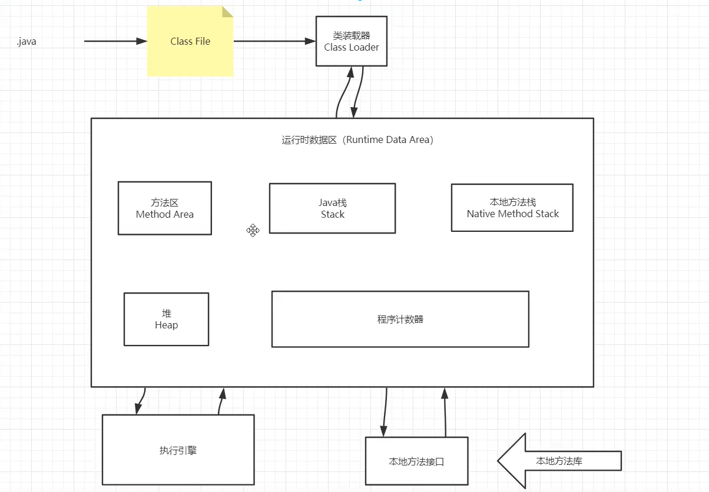

## JVM

### 问题提出

#### 对JVM的理解

Java虚拟机是一个可以执行Java字节码的虚拟机进程，java源文件被编译成能被Java虚拟机执行的字节码文件。

#### java8虚拟机的变化

#### 什么是OOM,栈溢出

#### JVM跨平台

针对不同的操作系统有不同的JVM来调用它们的不同的底层接口，最后将.class文件编译为对应的机器码。

#### JVM的位置

### JVM体系结构

程序计数器、虚拟机栈、本地方法栈线程私有。

#### 组成

类加载器、运行时数据区、执行引擎、本地方法接口

### 类的生命周期

加载 ——验证——准备——解析——初始化——使用——卸载

### 什么是类的加载

通过类加载器将类的class文件读入内存，并为之创建一个Class对象（封装了类在方法区内的数据结构）

### 类加载器

- 根类加载器
- 扩展类加载器
- 应用类加载器

#### 类加载器加载过程（双亲委派）

1. 检测是否被加载过，加载过则直接返回class对象
2. 请求父类加载器载入目标类
3. 父类不成功则从当前类加载器进行加载，失败的话抛出异常

好处：通过类加载器的层次关系避免了类的重复加载

#### 怎样打破双亲委派

不仅要继承ClassLoader类，还要重写loadClass和findClass方法。

### Native 方法区

- Native方法：java调用非Java语言实现的接口
- 方法区：它存储已被Java虚拟机加载的类信息、常量、静态变量、运行时常量池等

### 三种JVM

- Sun公司，HotSpot
- BEA，JRockit
- IBM，j9vm

### 堆

- 只有一个堆内存
- 堆的大小可调节
- 存储对象的实例
- 三个区域
	- 新生区
		- eden区
		- 幸存0区
		- 幸存1区
	- 老年区
	- 永久区

### Minor GC

当eden区满后触发minor gc来清理垃圾，存活下来的对象会被送到survivor区

### Full GC

收集整个堆中的垃圾，当老年代满之后会触发

### 可达性分析算法

从GC Roots作为起点，通过引用链找到一系列对象，如果一个对象不可达就会被回收。可作为GC Roots的对象：

- 虚拟机栈（栈帧中的本地变量表）中引用的对象。
- 方法区中类静态属性引用的对象。
- 方法区中常量引用的对象。
- 本地方法栈中JNI（即一般说的Native方法）引用的对象。

### 垃圾清除算法

#### 标记清除法

标记和清除效率不高；产生大量内存碎片

#### 标记整理法

适合存活对象多，垃圾少的情况；不产生碎片

#### 复制算法

- 将内存按照容量大小分成相等的两块，每用完一块就将存活的对象转移到另一块上，然后移除使用过的空间
- 不产生碎片；内存使用率低

#### 分代收集法

把Java堆分为新生代和老年代，这样就可以根据各个年代的特点采用最适当的收集算法。

### 典型的垃圾回收器

#### 新生代

- Serial：单线程使用复制算法收集新生代垃圾
- ParNew：上者的多线程版本
- Parallel Scavenge：提高吞吐量的多线程版本，不适合交互任务较多场合（也为复制算法）

#### 老年代

- Serial Old：Serial 老年代版本，标记整理算法

- Parallel Old

- CMS：标记清除，可以和用户线程一同工作，不需停顿

	初始标记：标记GC Roots能直接到的对象。速度很快但是仍存在Stop The World问题。

	并发标记：进行GC Roots Tracing 的过程，找出存活对象且用户线程可并发执行。

	重新标记：为了修正并发标记期间因用户程序继续运行而导致标记产生变动的那一部分对象的标记记录。

	并发清除：对标记的对象进行清除回收。

	- 对CPU资源敏感
	- 无法处理浮动垃圾（用户线程新产生的）
	- 产生碎片

#### 公用

- G1：标记清除，将堆分为多个大小相等的独立区域Region，新生代老年代不再物理隔离

	- 初始标记：标记出 GC Roots 直接关联的对象，这个阶段速度较快，需要停止用户线程，单线程执行。

	- 并发标记：从 GC Root 开始对堆中的对象进行可达新分析，找出存活对象，这个阶段耗时较长，但可以和用户线程并发执行。

	- 最终标记：修正在并发标记阶段引用户程序执行而产生变动的标记记录。

	- 筛选回收：筛选回收阶段会对各个 Region 的回收价值和成本进行排序，根据用户所期望的 GC 停顿时间来指定回收计划。单线程执行。

### 引用类型

- 软引用：用SoftReference类来实现的一个类，系统内存足够时它不会被回收，当系统内存空间不足时它才会被回收
- 弱引用：弱引用需要用WeakReference类来实现，它比软引用的生存期更短，只要垃圾回收机制运行，总会回收该对象占用的内存

- 强引用：具有强引用的对象即使发生空间不足也不会被垃圾回收。
- 虚引用：需要PhantomReference类来实现，无法得到对象实例，随时可能被回收
# 第二部分 自动内存管理

## 第二章 Java内存区域与内存溢出异常
