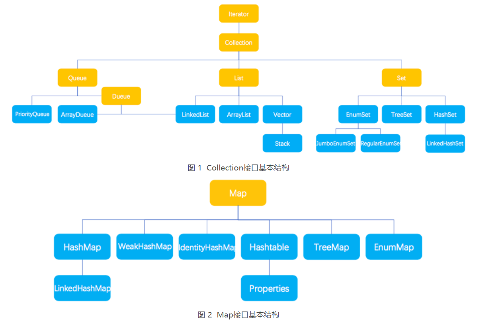

# 集合类

## 集合概览

- List：有序集合，可重复
- Set：无序，不可重复
- Map：Key-value存储

## ArrayList LinkedList

### ArrayList

底层由object数组实现，地址空间连续便于随机访问；扩容时需要创建一个新数组将数据拷贝进去，代价较大。

#### 扩容机制

- 无参构造时，默认为一个空数组，此时添加第一个元素，直接变为10，懒加载；大于10则直接变为该值
- grow()函数扩容
	- 先将原容量增加值1.5倍
	- 如果不够就直接变为需要的容量
	- 检测新容量和MAX_ARRAY_SIZE大小，前者大则再拿需求容量和MAX_ARRAY_SIZE比较，前者大设为INT_MAX，后者大设为MAX_ARRAY_SIZE。

#### 对比Vector

Vector线程安全

### LinkedList

底层使用Node数据结构，并且带有前后两个指针，是双向链表的实现；增删效率较高；占用空间较大，存储了前后双指针

## Set

HashSet 是 Set 接口的主要实现类 ，HashSet 的底层是 HashMap，线程不安全的，可以存储 null 值；

LinkedHashSet 是 HashSet 的子类，能够按照添加的顺序遍历；

TreeSet 底层使用红黑树，能够按照添加元素的顺序进行遍历，排序的方式有自然排序和定制排序。

## HashMap Hashtable ConcurrentHashMap

### HashMap

- Node数组+链表/红黑树实现

- 哈希码&长度减一得到index，比直接%长度性能好

- 将hashcode的高16位和低16位进行异或操作，这样做的目的是：在table的长度比较小的情况下，也能保证hashcode的高位参与到地址映射的计算当中，同时不会有太大的开销。

- put具体流程如上

- 扩容机制

	- table中长度超过阈值（总长度*负载因子）时需要扩容
	- 长度变为两倍
	- 在哈希码&长度减一的式子上多加一位，看看多出来的那位是0还是1，依次判断是否需要移位

	- 死循环：多线程操作产生扩容时由于链表倒插会死循环（1.8中解决）

- 和hashtable比较
	- hashtable继承于dictionary类
	- 线程安全，并发性差
	- hashmap和高位运算重新计算hash值并且用&得索引，hashtable直接用hashcode并求模
	- hashtable扩容为*2+1
	- hashtable不允许null键值

- 1.7和1.8的区别
	- 数组+链表/数组+链表+红黑树
	- 头插法/尾插法
	- 1.8简化了扩容后位置的计算
	- 1.8插入后扩容，1.7扩容后插入

- 为什么允许空键值
	- 键为空是直接返回0
	- hashtable会抛出异常

### ConcurrentHashMap

1.7 和 1.8的差别

- 取消segments，对table数组元素加锁
- 增加红黑树

## fail-fast

使用迭代器对集合进行遍历的时候，多线程下操作非fail-safe的集合类可能就会触发 fail-fast 机制；或者遍历时对集合修改也有可能触发

## fail-safe

在遍历时不是直接在集合内容上访问的，而是先复制原有集合内容，在拷贝的集合上进行遍历.